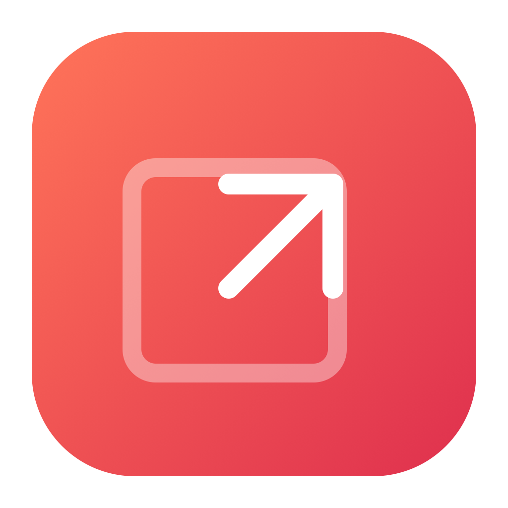

# QuickDraw

A tiny native Mac menu-bar app for drawing arrows and boxes over your screen.

## Install

Requires macOS 13 or later. Universal app for Apple Silicon and Intel.

Download `QuickDraw-v1.0.0-macOS-universal.zip` from [Releases](https://github.com/aadil6971/quickdraw/releases/latest), unzip it, and drag QuickDraw to Applications.

This initial release is ad-hoc signed, not Apple notarized. macOS may block the downloaded app; after attempting to open it, use System Settings → Privacy & Security → Open Anyway if you trust this release. You can also build from source using Apple's command-line tools.

Open `dist/QuickDraw.app`. The first launch enters drawing mode. Use the **Draw** menu to start again or quit.

| Shortcut | Action |
| --- | --- |
| Control + Option + D | Toggle drawing globally |
| A | Arrow |
| B or R | Box |
| Shift + drag | Square or arrow snapped to 45° increments |
| Command + Z | Undo the latest shape |
| Delete | Clear all shapes |
| Escape | Clear and exit drawing mode |

Click and drag anywhere outside the small control bar to draw. While drawing, the overlay captures clicks; exit to interact with other apps. Ending a drawing session clears its shapes. Changing monitor configuration also ends the session.

No dependencies, network calls, screen capture, Accessibility permission, or account. The global shortcut uses macOS Carbon hotkey registration. If the shortcut is taken, use the menu-bar entry.

Build with `bash build.sh` (requires Apple's command-line developer tools). The app is locally ad-hoc signed, not notarized for distribution. Move the built app to Applications if desired.

## License and credits

MIT. The icon incorporates Lucide's `arrow-up-right`; its upstream ISC license and attribution are included in `Assets/LUCIDE-LICENSE`. The SVG, PNG, and macOS icon are included in `Assets`.
